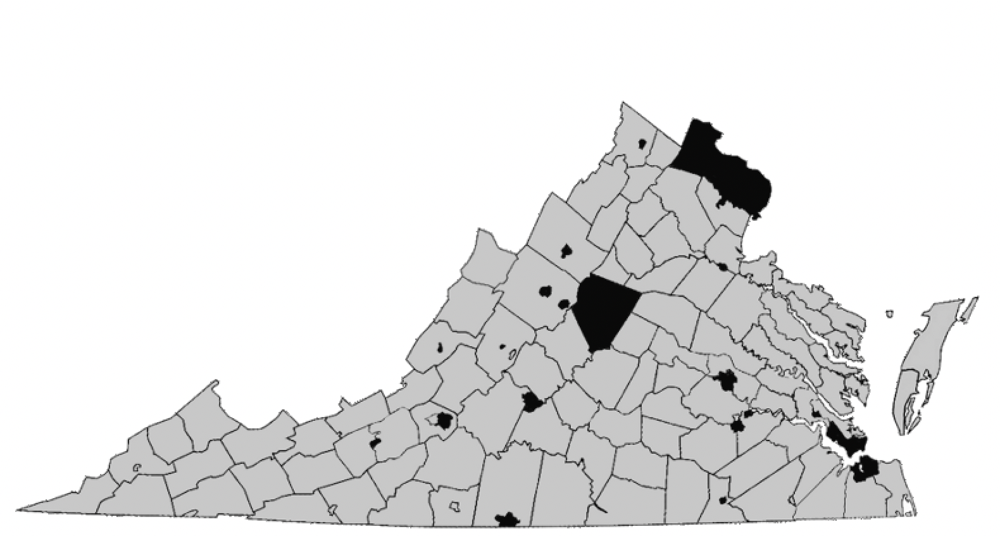

# 第 5 章 —— 耦合与封装

如果你曾经在一个大公司工作，那么你很可能经历过人们绕过指挥链（在任何方向上）时所造成的混乱。一个组织可能变得不稳定，当 CEO 跳过所有的经理向工程师直接发出命令，或者一个销售代表绕过中间管理层直接向 CFO 汇报。一个更让人忌讳的例子是 CEO 和某个初级员工有私人关系。在所有案例中，中间管理层的权威和“独立”都被削弱了。

这个问题可能变得更复杂，如果一家公司是由很多大体上独立运营的小公司组成的综合企业。绕过指挥链可能会瓦解子组织设计好的自治，产生隐蔽的依赖，甚至把组织暴露于法律责任中。

在一个遵循相对权力法则的民主社会中，为了确保人民保留授予政府合法性的权力，每个人都遵循指挥链是很重要的。当我们看到这如何发生，你将开始明白“名义民主”帝国如何通过违反指挥链从人民那里夺取权力。

谁应该有权威向个人收税呢？他们的当地社区，他们的州，他们的联邦政府，还是所有以上这些？我们目前生活在一个上述所有机构都在收税的世界，一个社区主权和独立被大肆破坏的世界。

让我们用一个类比来描述遵循指挥链的重要性。想象一个州之间的民主就像是一个人们之间的民主。现在想象人们的民主政府有权向人民的细胞直接收税。你肯定会质疑一个人的精神状态，如果他同意一个让别人控制他哪怕是部分身体细胞的和平条约。

这些细胞现在有两个主人，你的大脑和那个通过别人的大脑运行的政府。事情开始看起来像是《黑客帝国》中的一幕，人类被机器奴役，机器从每个人身上抽取“能量”（即，权力）同时控制他们的感知。个人的大脑生活在一个模拟的现实之中，那里假装有自治权，但真实的身体却是被链接的、虚弱的、依赖于外物的并且被抽干所有剩余能量。用这种方式，州假装他们有自治权，但他们的身体（生活在这个州的人民）却是被链接的、虚弱的、依赖于外物的并且被美国国家税务局抽干所有剩余能量。

如果没有正常人会自愿签下放弃部分身体控制权的和平条约，那么为什么会有任何正常的社区签署放弃成员控制权的和平条约呢？人们组成社区的原因是为了共同保护他们的权利，所以一个放弃成员控制权并交给外部势力的社区政府是失职的，并且让他自己丢失了民主合法性。

一个州之间的民主应该不知道州的内部组成。从一个计算机科学的角度来看，州由县组成，县由镇组成，而镇又由人民组成是实现细节。在一个联邦层面，和平条约是一个州之间的民主，这里每个州都是平等的。

现在从一个“收税”的角度考虑这如何工作？如果州对州对和平条约呼吁各方支持联邦的融资，那么这些融资必须来自其成员且经过成员授权。这意味着个人应该永远不用和联邦政府打交道除非他被选为或者委任为州的代表。所有的联邦税务应该向州发出账单，每个州必须有自治权决定如果募集钱来交这些税。这样的结构保证了一个州能够作为整体选择是否退出联邦，而不用改变其税收结构中的任何事情，也不用个人担心是否需要交联邦税。

这个想法被美国宪法的起草者不完全地理解，宪法中说直接税务应该在州之间分配，并且为了分配我们应该进行人口普查。分配的概念是一个反民主的概念，它就像是在说每个人的投票权应该和他们的体重区间成比例，或者他们支付的总税务应该基于身体细胞的个数。分配实际上是说“一些人”比另外一些人“更平等”，但民主应该是在丛林法则之下，在自愿同意和平条约的平等人中产生。

在一个真正的民主系统中，一个人在平等的各方中协商，各方拥有平等的投票权、平等的义务和平等的收益。所有的州应该有同样的税务。一个像加利福尼亚的州需要进行拆分，如果它的人民想要额外的影响力，但是这样做会导致它支付额外的会员费。用这种方式，会员费还是按人口分配的，但只是要求大家的自治能力也比较匹配。这样就防止了小一点的州免受加利福尼亚人民的“合谋”。

想象如果联合国有权力通过一个所得税方案，施加于全世界人民。这将直接削弱美国的自治。今天，美国和其他国家共同给联合国提供资金，每个国家可以作为个体决定离开或者撤回资金。但即使是这里，资金来源也不平均（美国支付了 70%），这给了某些国家在联合国中更多的影响力。

向个人征收的联邦税破坏了隐私，以及州政府和县政府的独立。它从政府的基层（人民）直接抽取财富，然后用它来强制州和地方服从。例如，联邦政府能够扣留学校、公路、警务的资金除非各州听话。通过允许联邦政府使用人们的资源来对抗州，州把自己的独立给削弱了。在钱已经被联邦政府从人民那里收走的情况下，州的人民（比如弗吉尼亚公民）就缺少资金来建立自己独立的学校如果他们不能和美国~~教育~~灌输部达成一致。如果一个州已经不能控制税收现金流，那么这个州的人民要组织税务问题罢工就变得更困难。

让我们把这个问题推广到极端。如果联邦政府在人民身上执行一个 90% 的所得税方案，然后根据州政府是否听话来给予他们资金，会发生什么？更进一步，再假设税务减免在州和当地税收中不被允许。还有多少钱可以剩下让州和当地来征税？州政府还有什么自治权和能力来代表人民吗？会有任何之前独立的州事先同意这样的条款吗？如果没有人会事先同意这些条款，那么一个逐渐走到了这步田地的系统存在什么合法性吗？

州政府的意义是代表县政府们，县政府的意义是代表县里的人民。一个人在他的当地县被代表的可能性远远超过他在由好几亿人组成的州联邦中被代表的可能性。人们可以在他们的县里达成共识，并且这个共识让县里的每个人拥有更多权力。他们的县，作为一个团结了 50,000 个聚居在一起的人的前线代表，有比 50,000 个不合作却想要达到相同影响力的人远远更多的力量来和州谈判。这就是两个人协作如何能敌过两个不合作的人的一种情况。每个大型社会的成员的有效力量达到最大，当他们被组织成小的自治的结构。

## 案例研究 —— 弗吉尼亚持枪权

这个案例研究和一个让很多人难受的问题有关。请花一点时间放下你在枪支上的个人观点，并记住我们是在研究真正的民主中达成共识的程序。预期的结果不能合理化或无效化方法本身。这个案例研究中讨论的原则也适用于其他问题，比如堕胎、大麻和移民，在这些问题中，这个程序也许就支持你的观点。

弗吉尼亚州有 850 万人，组织成了 95 个县，大多数人口集中在市区，那里的主流党派是“民主”党，我将在后面把这个党派称为 DINO 党（Democratic In Name Only，仅名义上的民主党），因为他们没有奉行真正民主的原则。因为弗吉尼亚不是一个由县组成的民主组织，州政府最终被 DINO 党控制了。DINO 党宣扬解除人民的武装，而基于各个当地政府通过的决议，这是弗吉尼亚 96% 的县积极反对的。

如果弗吉尼亚是一个由县组成的民主组织，那么结果会非常不同。整个州会承认个人持有武器的权利，那 96% 的县的人们会让他们的权利更好地得到保护。

那些生活在支持禁枪的县的人们可以退出弗吉尼亚并组织他们自己的州或者加入马里兰州的一些县；然而，这可能并不必要，因为一个县级民主实际上应该不会像关心县本身的独立性一样关心个人的持枪权。

这意味着如果 Loudoun 县想要在内部禁枪，那么 Floyd 县将不会关心。就像收税，执法不应跨越中间政府。一个县级民主将更关心每个县组织民兵的权利。一个州级民主将更关心每个州组织警卫队的权利，并且一个国家间民主将被关心的是每个国家拥有自己的军事力量的权利。

如果美国不向联合国放弃自己拥有军事力量的权利，那么为什么州要向联邦政府放弃自己拥有警卫队的权利，而县要向州放弃自己拥有民兵的权利，或者个人要向县放弃自我防卫的权利？

## 全球多数人统治？

如果民主是关于让少数人（弱势）服从多数人（强势）的意愿，那么中国就应该统治美国。这当然也不意味着一个拥有 3 亿 2 千万人的国家应该运营一个全球帝国，用政权更替的威胁来强迫其他 70 亿人。中国不应该控制美国，就像加利福尼亚不应该控制弗吉尼亚，就像 Richmond 县不应该控制 Floyd 县，或者像一个农场主不应该控制他的奴隶。

换句话说，拥有 51% 人口的 DINO 党不应该控制 RINO 党（Republicans In Name Only，仅名义上的共和党），就像 RINO 们不应该控制 DINO 们如果他们得到了 51%。党派政治本质上就像是把俄罗斯和美国的人口在同一片领土上混合起来，同时人们保持他们的俄罗斯或美国“身份”，并且每年我们都得抉择是选举一个俄罗斯人还是一个美国人作为总统来位列每个人之上。

只有在丛林法则之下，51% 统治 49% 才有意义。实际上，在丛林法则之下，51% 杀死 49% 也是合理的。甚至，1% 杀死 99% 都是合理的，如果他们有能力那么做。51% 威胁要杀死 49% 如果他们不服从，和 51% 真的杀死了他们，之间的区别是什么？如果 51% 不相信种族灭绝（或者因此带来的威慑），那么这意味着他们应该允许 49% 退出。

在一个议题上处在 51% 群体中的人们会面临一种强烈的诱惑来宣扬他们运营社会的理论是普适的。他们有什么可失去的呢？丛林法则可是站在他们那一边的！有一个很知名的说法：

> 一开始他们冲着共产党来
> 我没有说话
> 因为我不是共产党
> 然后他们冲着社会主义者来
> 我没有说话
> 因为我不是社会主义者
> 然后他们冲着工会成员来
> 我没有说话
> 因为我不是工会成员
> 然后他们冲着犹太人来
> 我没有说话
> 因为我不是犹太人
> 然后他们冲着我来了
> 而且已经没有剩下的人
> 可以为我发声

这里的含义是，站在大多数人一边可以，直到有一天你再也不是大多数人。

不论你的思想系统是什么，你不会永远都处在大多数人之中。采用一个今天服务于你，但是明天却合理地弄死你的思想系统是非常愚蠢的。

## 来自软件工程的一课

退出是很困难的，如果政府的结构没有遵循低耦合和强封装的原则。我过去把职业生涯用在开发复杂软件和“区块链操作系统”上。治理可以被看作不过就是一个社会操作系统。从一个计算机程序员的角度看，你会想把代码组织成函数，函数组织成类，类组织成包，包组织成程序，程序组织成操作系统，操作系统组织成内联网，内联网组织成互联网。不能把你的代码模块化，并且遵循合适的 API（接口），将会产生难以维护、查错、复用或升级的“意大利面烂代码”。结果将是漏洞、数据出错、缓慢的开发进度。通常，从头开始重新写一个程序比修复“意大利面烂代码”还快。意大利面政府几乎总是会崩溃，并且很少有机会重组。

为了防止“意大利面烂代码”问题，开发者遵循模块化（地理分组）、低耦合（权利分立）、最小化依赖（独立）和公共接口隐藏实现细节（隔离联邦政府和人民的接触）的原则。一个稳定、复杂的社会如果遵循其中的一些设计原则将会是智慧的。用这种方式，如果某个地区有问题，它不会拖垮整个社会。

