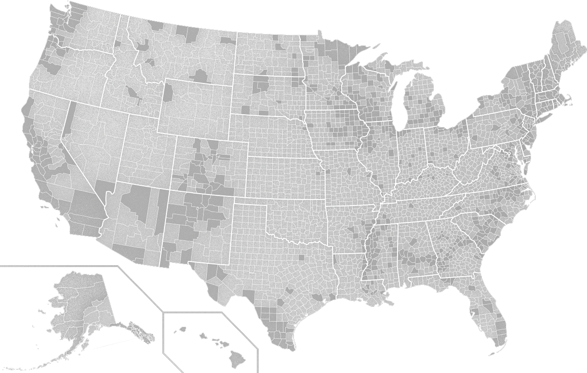

# 第 7 章 —— 政治晋级赛

如果优秀的治理技能就像是象棋比赛中的技能，会怎样？想象美国和中国决定通过各自的领导人参与象棋比赛来解决他们的分歧。人民希望确保自己的国家能赢，那么现存的 DINO 选举程序将怎样运行呢？

考虑一下，一般的投票人对于象棋是合理的无知，并且从来没有实际玩过。人们把自己分成党派，支持有不同下棋理念的候选人。人们只是得到了一个投票给象棋空谈专家的机会。

最终，这个被选出的总统将会是那个最善于说服别人相信他们会玩象棋的人 —— 一个基本上和真正的下棋不相关的技能。实际上，最好的象棋选手可能会害怕说服别人他们最会玩象棋。想象如果没有人可以下棋直到被选为总统。人们难以阅读象棋比赛的历史数据。你会押注如此选出的一个候选人吗？

如果美国需要象棋技能来赢过中国，那么大多数人会推荐通过锦标赛来找到最好的选手。每个有兴趣在与中国的象棋比赛中代表美国的人都可以参加。他们会被随机匹配来玩一局。第一轮的赢家将会和其他赢家随机匹配。这个过程持续，直到一个象棋冠军被确认，并且这个冠军将会迎战中国。这应该很清楚了，相比于投票，一个锦标赛远远更有机会发现和产生一个非常优秀的选手。

为了防止同一个顶级象棋选手终生统治。领导人可以从头部 1% 的象棋冠军中随机选出。这将会最小化作弊者确保赢得选举的机会，以及修正偶尔出现的神经不正常的象棋大师。

不幸的是，我们没有简便的方式来举办一个运营国家的锦标赛。然而，如果我们能设计一个比赛，检验跟优秀治理高度相关的技能，那么这将会是一个比今天我们所玩的党派政治游戏更合适的代表过程。

如果政府的目的是让一群人可以达成共识，那么它应该由某个最擅长共识建设艺术的人来领导。最优秀的共识建设者是一个能获得人们团结一致的授权的人；最差的人则是一个把人们分裂为对立党派的人。

为了发现最好的共识建设者，我们设立一个锦标赛，把人们随机分配到小组中（约 10 人）。每个组必须达成一个大多数人的强共识（约 7 / 10 的共识），决定他们中的一个成员来代表他们这一组。在计算机科学中，2 / 3 + 1 代表拜占庭容错的阈值。这将检验谁是每个组中最有效的共识建设者。一个不能达成共识的组，就像是一局时间耗尽的象棋比赛，这个组中没有人可以在锦标赛中继续前行。这个过程重复进行，直到最好的共识建设者被确认。

想象我们的社会会是什么样，如果每个民选职位上的人都需要这样一个过程。你觉得国会还会只有 30% 的支持率并且政府的信任度低于 20% 吗？如果中国也使用类似的程序，一笔贸易交易在两个共识建设专家之间达成的概率将是多大？

理论上，一个晋级赛系统可以允许十亿人在仅仅 8 到 9 个回合后确认一个国会/议会，每一回合分配给一个月的时间来达成共识。总之，这整个过程使用的时间应该会远少于人们从初选到普遍选举中花在竞选活动和辩论上的时间。然后国会或者议会从他们的成员中选择主席、副主席和最高法院。另外，立法、司法、行政系统可以有独立的锦标赛。

仅仅因为政治晋级赛可以拓展到数十亿人，并不意味着把每个人都组织在一个晋级赛层级结构中就是好的策略。这样做依然会违反个人和群体之间的相对权利法则；比如，如果没有明确的方式达成如何把社区解散为独立自治单元的共识，那么就没有简单的方式来“一走了之”。没法“一走了之”，说不的能力就丢失了，没法说不，谈判和授权的能力就丢失了，没有授权，就没有合法性，没有合法性，就没有民主。

为了更好的支持退出的权利，想象一个国家中的每个郡都用一个政治晋级赛来选出一个“管理者委员会”。因为一般的郡有 5 万人，这个晋级赛可以用仅仅 2 到 3 个回合完成，有机会在一天内全进行。一旦委员会被选出，它可以从成员中选择一个人来在更高层级上（比如州）来代表这个郡。

美国有 3141 个郡。想象如果每个郡都是自治的，并且能够加入任何能接受它的州或国家，而且不用向它之前所在的州或国家要求脱离的许可。在每个州内部，所有的郡将用一个政治晋级赛来任命他们的州议会代表。最后，如果他们选择，每个州可以加入一个联邦治理框架。

这个结构的关键部分就是它保持了用退出来解决分歧的能力。不喜欢当地郡管理委员会的人可以搬到隔壁的郡。一个不喜欢它的州的郡可以成为独立的国家或者加入其他的州。一个不喜欢“合众国”的州可以独立或者加入一个不同的联邦。

这里的原则是，更高级别的政府是“政府们的政府”。这最大化了局部自治，并且给了当地决定自己的路线的自由，让大家可以共同生活。如果我们想要一个世界政府，它应该由可以随时自由退出的独立国家组成。

## 撤销职位

某些情况下，一个代表可能死了或者背叛他的选民，以至于他必须在任期结束前被撤销职务。在任何时间，一个 10 人的组可以通过达成一个新的大于 2/3 的共识来改变他们的代表。这会产生一种流动民主的形式，作恶的人可以在他们做出更多伤害之前被发现和清除。

## 美国的变化

多个政府联合组成政府这样的结构更接近于美国原本的宪法，在第 17 修正案之前，是州立法机构选择联邦参议员。第 17 修正案实际上通过抹平个人和联邦政府之间的代表制金字塔，去掉了“州”在联邦层面的代表。州加入联邦时是预期他们可以有权利退出的。

另外的代表集中化发生在国会议员数量的封顶上。在 18 世纪初叶，每 5 万人有一个国会议员，现在，这已经大于 65 万人。这意味着，在线性关系上，国会议员的相对于个人的权力增长了 10 倍。由于非线性，帕累托分布，权力的属性，这也可能是国会议员相对于人民的权力增长了 100 倍。

通过转向一个“政府们的政府”的系统，每个郡可以有平均 5 万人口，3141 个郡任命的代表将和我们在原本的宪法下拥有的国会议员数量差不多。通过连接议会代表区到郡，我们可以最小化操控选区的机会。

从一个独立州的联邦到一个实际上的“名义上的民主”帝国的改变已经削弱了人民控制自己命运的实际权力。抵制分离的运动是现状夺走人民达成新共识的主要方式之一。

## 低科技政治晋级赛过程

任何民主程序都应该足够简单，以便任何社区都可以实现它而不依赖高科技解决方案。一个过程依赖越多的科技，它就越依赖一小部分科技服务商，并且对于大众来说越难以接触。而低科技解决方案应该可以从 50 人的小组扩容到由数十亿人组成的国家。

实现一个政治晋级赛需要把人们按 4 到 12 人随机分组，所用的方式要让每个参与的人都高度确定这是真的随机性。四个人是实现一个 2/3+1 拜占庭容错共识的最小要求。然后每个组必须选择他们的成员之一来代表这一组。让我们开始演示小规模下这个过程如何工作，然后拓展规模。

## 小于 200 人的社区

让我们从一个 50 人的小社区开始，比如一个教堂、俱乐部或者 50 个州的代表们。这个团体会在当地社区活动中心或者联谊大厅举办一个活动，设置 13 张 4 个人的桌子。一旦每个人都到场，主持人将带一盒纸牌到台上，并且给每个人在所有其他人面前洗牌的机会。然后，每个人排队领取一章纸牌。每张桌子将对应一个纸牌大小（A、2、3）。人们收到纸牌后去往与他们的纸牌对应的桌子。

一旦每个人都在他的桌子就位，讨论就可以开始，在这期间，人们协商决定谁能最好地代表他们那一桌。一旦一个人被确认，他会得到其他人的纸牌。一个人必须得到四张纸牌中的至少三张才能代表那一桌。

一旦所有桌都结束了，最多会有 13 个代表，每人至少有 3 张牌。这时，代表们可以在整个社区面前（在台上）进行一个讨论，选择一个领导者。这个领导者必须拥有至少 9/13 的选票（2/3+1）。在没能产生超级大多数共识的情况下，这个过程重来。一个可以防止从贿赂到名人偏见等一切问题的替代性方法是从头部的 13 个人中随机选择。另外一个替代方案是，让头部的 13 个人分成 3 个随机的小组，每个组挑选一个代表，然后从头部的 3 个人中随机选择。

这个过程可以拓展到最多 200 人，通过加入更多盒纸牌和增加初始的桌子容量到 12 人。

## 1000 人的社区

拓展政治晋级赛到 1000 人的社区需要程序上的一点变化。一个千人团体可以很容易找到一个大会厅，比如一个可以支持 100 张十人桌的学校。这种情况下，我们将会需要 20 盒两种不同样式的纸牌，比如红色背面和蓝色背面的纸牌。每张桌子对应一个值和背面颜色（例如，红色 A，蓝色 9，等等）。再一次，人们将可以参加洗牌，然后排成队取走一张牌，然后去到他们的桌子。每一张桌子将会有 10 个人，他们需要达成一个 7/10 的共识。

一旦所有桌子都选出了他们的代表，那么第二轮将用 100 人团体的规则展开。

## 一万人以上的社区

当一个社区达到一万人的时候，在任何单一地点开展都会显得人太多，这就是时候开始把人们分组成千人的选区。每个选区应该大致相同大小（在 900 到 1000 人之间），并且将会利用 1000 人社区的流程来选择一个选区代表。这 10 个选区代表将会碰面来选择最后的代表。